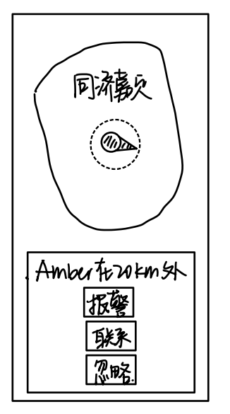
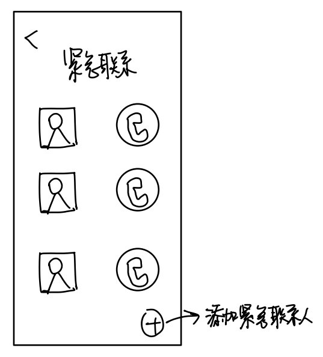

# HCI期末项目—— `EchoCare` 设计文档

[TOC]

## 1.引言

### 1.1.项目背景

#### 1.1.1.阿尔兹海默症的社会影响和现状

阿尔茨海默症（ **Alzheimer's Disease** ）是一种神经退行性疾病，主要影响老年人，导致记忆丧失、认知功能下降和行为变化。

阿尔茨海默症带来的社会影响是多方面的，主要体现在对患者家庭和医疗系统两个方面。

1. 对于阿尔茨海默症患者家庭来说，护理阿尔茨海默症患者的费用高昂，包括医疗费用、护理费用和日常生活开支，这对家庭经济造成巨大压力，与此同时，家庭成员需要承担照顾患者的责任，导致精神压力增加，甚至可能引发抑郁和焦虑。

2. 对于社会医疗系统来说，阿尔茨海默症患者需要长期护理，占用了大量医疗资源，如医院床位、护理人员和专业设备，随着患者数量的增加，医疗系统面临的经济压力也在上升。

目前全球范围内阿尔茨海默症患者数量不断增加，主要由于人口老龄化趋势明显。据估计，全球约有5000万阿尔茨海默症患者，这一数字预计将在未来几十年内大幅增长。尽管科学界对阿尔茨海默症的研究投入了大量资源，但目前尚无根治方法。现有的治疗手段主要集中在缓解症状和延缓病程。然而早期诊断阿尔茨海默症依然困难，很多患者在疾病晚期才被确诊，错过了最佳的干预时间。这导致阿尔茨海默症患者的病情愈加严重，形势更加紧急。

#### 1.1.2.阿尔兹海默症患者和监护人面临的挑战

对于阿尔兹海默症患者来说，他们会出现认知功能下降、语言和沟通困难、行为和情绪变化、日常生活困难等情况（具体原因会在后续病症分析中说明），这会严重影响他们的生活质量，给他们的日常生活带来挑战。

而对于阿尔兹海默症患者的监护人而言，则需要投入大量的时间和精力来照看患者，此外还需要支付大量的医疗费用，扛起巨大的经济负担，这无疑是一个严峻的挑战。

### 1.2.项目目标

通过微信小程序开发平台，开发出一个便捷的、用户友好的工具—— `EchoCare` ，帮助阿尔茨海默症患者和他们的监护人更有效地管理日常生活和护理任务。利用创新的技术手段和全面的功能设计，为阿尔茨海默症患者和他们的监护人提供全方位的支持和帮助，提高患者的独立性，减轻监护人的负担，帮助监护人高效的照护患者，力求改善阿尔茨海默症患者及其家庭的生活质量。

## 2.项目前期准备工作

### 2.1.阿尔兹海默症病症分析

阿尔茨海默症患者的表现随着疾病的进展而变化，通常可以分为早期、中期和晚期三个阶段。在早期，会出现记忆力减退的情况，忘记重要日期、事件或名字，难以做出决策或计划日常活动。同时在定向上也会出现障碍，容易在熟悉的地方迷路，例如在家附近走失，不能正确识别时间、地点和人物。到中期后，记忆丧失变得更加严重，甚至无法回忆起家庭成员的名字，忘记自己的住址或电话号码，同时对日常的简单任务都难以完成，例如穿衣、做饭和个人卫生，容易在家中迷失方向，无法找到自己的房间或浴室，需要他人帮助完成日常生活任务。直到晚期，患者几乎失去自主生活能力，完全无法自理。

基于上述病症描述，我们的项目主要是为早、中期阿尔茨海默症患者及其家庭服务，改善他们的生活质量以及提高监护人照看患者的效率。

### 2.2.需求分析

#### 2.2.1.阿尔兹海默症患者需求分析

对于阿尔兹海默症患者的需求分析，主要有以下几点：

- **用药提醒**：定时提醒患者按时服药，并记录服药情况。
- **日常活动提醒**：提供清晰的日程安排和提醒功能，帮助患者记住每日的活动和任务，如进餐时间、锻炼时间、社交活动等。
- **医疗预约提醒**：提醒患者及其监护人即将到来的医生预约或治疗安排。
- **定位追踪**：实时定位功能，帮助监护人了解患者的位置，防止走失。
- **紧急求助**：一键求助功能，让患者在紧急情况下可以快速联系监护人或紧急服务。

#### 2.2.2.监护人需求分析

对于阿尔兹海默症患者监护人的需求分析，主要有以下几点：

- **任务管理**：帮助监护人安排和跟踪患者的护理任务，如用药、就诊、日常护理等。
- **健康记录**：记录患者的健康状况、症状变化和医疗建议，方便随时查阅和分享给医生。
- **定位追踪**：实时查看患者的位置，确保他们的安全。
- **紧急通知**：在患者遇到紧急情况时，立即通知监护人和相关的紧急服务。
- **远程照看**：通过监控设备来照看患者的日常生活，同时利用远程遥控来帮助患者操控日常设备
- **社区信息共享**：供所有患者家庭之间交流经验的社区，同时还可以推送最新医疗信息

### 2.3.市场产品竞争分析

- 目前市场上对于上述需求中的每一项几乎都有对应的产品可以解决用户的需求，例如对于定位需求，有地图软件；对于任务管理需求，有对应的日常任务管理软件；对于药物管理需求，有对应的医疗软件。但这些产品都无法完全满足阿尔兹海默症患者及其家庭的大部分需求的，也就是说，他们的功能是非常单一的。

  ​	对于集成上述软件的功能的实体产品在市场上也是有的，比如智能电话手表，然而这种产品的主要受众是儿童。这种产品的优点在于便携性，然后对于大多数老年患者用户，手表界面是比较小的，界面上的图标、文字也一定是较小的，而老年患者用户大多存在视力上的问题比如近视或者远视（后者居多），这样的产品老年患者是无法正常使用的，也就是说没有考虑适老化设计。

  ​	除此之外，上述的已有产品应用于老年阿尔兹海默症患者的共同问题在于用户交互模式过于复杂，为了简化用户实现某一功能的交互流程，应该尽量通过少量的用户操作来达到满足用户要求的效果。

  ​	综上，本项目开发在于解决阿尔兹海默症患者及其家庭困难的社会痛点，设计时主要要考虑以下几点：

  - **功能集成**：需要结合日常任务提醒、药物管理、安全定位等功能，以提供更全面的解决方案
  - **用户友好设计**：应用的用户交互模式需要极简化，直到适合老年患者和其监护人使用，比如使用大图标、简单指示等方式
  - **监护人连接**：允许监护人实时监控和接收患者状态的警报功能可以提升整体护理体验

## 3.项目设计

### 3.1.项目预期实现

在下面描述项目的预期实现过程中，我们采用项目的低保真原型来辅助讲解。

本项目面对的对象有两类人，一类是阿尔兹海默症的患者，一类是负责监护患者的监护人家属，故需要为项目设计欢迎界面来确定用户的角色，如下图所示：


对于不同的用户角色，其具体界面及其功能是不同的，但需要实现资源上的共享于远程的通信，这需要患者账户与监护人账户之间的联系绑定，只有绑定成功的患者与监护人才能共享信息，如下图所示：


对于监护人的定位追踪需求，我们需要使用实时的将患者的位置展现给监护人，同时确定其是否在安全区域内，如下图所示：


对于不在安全区域内的情况，需要提供报警或紧急联系的接口，如下图所示：



此外，监护人还需要可以实时照看患者的健康状态，获取其健康情况的报告，如下图所示：


在医疗方面，监护人需要一个远程提醒的功能来提醒患者及时服药或及时就医，如下图所示：


同时在监护人对专业知识或经验分享的需求方面，我们应该为监护人提供一个公共的网络社区，进行专业知识的推送以及监护人们护理经验的分享帖子的推送，如下图所示：


对于监护人们的日常照看需求，可以设计一个智慧监控的功能来实时照看患者的居家生活，如下图所示：


同时，还可以提供远程视频通话的接口，供监护人与患者进行联系，如下图所示：


考虑到患者独自居家可能不会使用家中的一些电子设备，我们可以设计一个远程遥控，方便监护人远程操控设备来满足患者的需求，如下图所示：


对于患者而言，首要的就是简单化操作的紧急联系，可以通过简单的点击来完成对常用联系人的联系，如下图所示：



其次考虑到阿尔兹海默症患者的方向迷失，我们需要设计一个简单易用的位置标记功能，如下图所示：


当患者忘记日常任务或不知道如何完成日常的简单事项时，可以提供一个日常任务备忘录，内设一个提醒功能，可以有效防止患者忘记日常重要事项，同时对于不知道如何做的简单任务，我们提供备注功能，可以简单记录日常任务的执行步骤，如下图所示：


对于一些重要信息的备忘，需要与日常任务进行区分，如药物的使用详情、重要物品的放置信息以及联系人的信息等，如下图所示：


综上，我们需要将这些细小的功能分两个用户模式进行整合，完成本次项目的设计，具体功能设计以及高保真原型界面将在下面叙述。

### 3.2.项目功能设计

本项目是基于微信小程序开发平台进行设计的，在下面的功能设计的叙述中，会使用到高保真原型界面进行辅助说明，移动端界面设定以 `iphone 14 pro max` 手机型号为例进行展示。

#### 3.2.1.角色设定

本产品的应用对象主要分为两类：一类是阿尔兹海默症患者群体，属于需要被监护的对象；一类是患者的家属，属于患者的监护人对象。这两个对象的需求在相互联系的同时又具有差异性，故为两种角色设计两个不同的应用界面来体现差异性，通过监护人账户与患者账户的绑定来实现二者之间的联系。

在进入注册账户界面时，我们提供给用户一个角色选择界面，来确定用户角色，从而明确后续相应的功能，高保真原型界面如下：


#### 3.2.2.角色绑定

​	在选择好相应的角色完成账户的注册后，下一步就是进行患者与监护人账户的绑定，在账户绑定的基础之上，监护人才能使用本产品来监护患者的日常信息或健康信息，为患者安排各种提醒事项。

​	由于这些信息都涉及个人隐私数据，故绑定的流程设计尤为重要，一但有居心叵测的人要恶意绑定患者的账户，偷取患者的私人信息，将会造成较为严重的后果。

​	综上分析，我们考虑设计验证码绑定流程，具体的绑定流程如下：

- 首先由监护人选择要爱护的对象，并向要绑定的患者发送绑定请求


- 确认发送后，患者账户会收到含有随机生成的验证码的绑定请求消息


- 患者在收到消息后，需要点击前往小程序，输入对应的验证码才可以完成绑定


- 患者界面的绑定成功显示


- 监护人界面的绑定成功显示


验证码的设计是为了防止患者误触导致的恶意绑定成功。一般情况下，使用本产品进行用户绑定时，都是监护人与患者线下同时进行绑定，也就是说，验证码应该是监护人帮助患者进行输入并完成最后的绑定（考虑到患者不会验证码输入的流程），这样可以有效的防止个人信息的泄露。

#### 3.2.3.监护人功能设计

在监护人与患者完成绑定后，监护人就可以使用针对于目前绑定的患者的一系列监护功能，主要分为四个板块：安全追踪板块、健康管理板块、远程照护板块、互动社区板块。如下图所示：


其中各个板块的功能设计如下：

- **安全追踪板块**

在使用该板块之前，监护人可以为患者设置安全区域，类似于电子围栏，我们认为只有患者处于安全区域中时是正常现象。安全区域的设置界面设计如下：


在设置好安全区域后，便可以实时的显示患者的定位，如下图：


当患者位于安全区域边界时，我们会向监护人发送消息通知，并提供给监护人紧急联系或直接忽略的选择接口，如下图：


若点击暂时忽略，则认为这是正常情况；若点击立即联系，则可以立刻与患者通话，如下图：


当患者彻底离开安全区域后，系统认为这是严重的情形，并为监护人提供紧急报警的接口，如下图：


点击一键报警后即可进入电话拨打界面，准备拨打 `110` ，如下图：


- **健康管理板块**

在该板块下，主要有三个子功能：患者健康情况的查询、设置服药提醒、设置就医提醒。如下图所示：


点击患者健康情况后，可以为监护人展示患者的日常健康状况图标，包括睡眠时间、心率、每日步数等健康信息，方便监护人了解患者的日常作息情况。具体内容显示如下图：


点击设置服药提醒后，可以显示当前已设置的药物提醒项目，如下图：


在上图基础上点击右下角的加号按键，可以进行药物提醒项目的添加，具体步骤包括：

设置药物名称、类型：


设置药物规格：


设置药物形状：


设置药物颜色：


设置提醒时间：


添加提醒备注：


经过上述过程后即可完成一个新的药物提醒的设置，系统将在患者账户根据监护人设计的时间准时提醒患者服药。

在点击就医提醒设置后，系统提供给监护人线上医院挂号的接口，并将挂号添加进就医事项中如下图所示：


挂号完成后在患者后监护人两个账户上显示就医事项，并准时提醒二者，如下图所示：


同时还可以点击右下角加号图标添加其它的就医事项。

- **远程照护板块**

在这个板块中，监护人可以进行远程的对患者的照看，包括：智慧监控、视频交互、远程遥控三个方面。


其中智慧监控通过在家中设置不同位置的监控来实时照看患者的日常生活状况，例如客厅监控、庭院监控或者是卧室监控。实现界面如下：


而点击视频交互，则可以直接拨打患者的视频通话，与患者面对面进行线上交流，如下图：


点击远程遥控，可以显示一些只能家居设备选项，比如空调、电灯、风扇等，可以通过监护人来远程操控这些设备来满足患者的需求，具体界面如下：


- **互动社区板块**

点击进入互动社区板块后，可以获取有关阿尔兹海默症相关医疗领域或日常的文章推送，方便监护人获取最新信息，如下图所示：


同时每个监护人还能处理未读消息，管理自己的主页，如下图：


#### 3.2.4.患者功能设计

在患者与监护人完成绑定后，患者就可以享有监护人为其设计的日常提醒功能以及一些个性化备忘功能，主要分为四个板块：紧急联系板块、位置标记板块、日程提醒板块、重要信息板块。如下图所示：


其中各个板块的功能如下：

- **紧急联系板块**

点击进入紧急联系板块后，可以显示当前存储的联系人信息，点击头像右侧的电话图标即可拨打对应监护人的通话。这样设计可以简化患者联系监护人的流程，没有太多的按键流程。如下图所示：


其中，点击右下角的图标，还能添加更多的联系人。

- **位置标记板块**

对于患者常去的位置，可以进行标记，方便系统快速辨别患者所在位置，屏蔽其它陌生地址信息的干扰。点击进入位置标记板块，即可查看已标记的位置，同时点击添加按键还能添加其它地址标记，如下图所示：


点击对应的位置标记，可以显示地图信息，当患者要前往对应位置时，可以选择对应标记的导航路线，帮助患者到达目的地，这样设计的效果是不需要患者去各种地图导航软件进行搜索，而是直接点击简单易懂的位置标记，即可开始导航，方便阿尔兹海默症患者使用，具体使用如下：

去公园：


回家：


去医院：


- **日程提醒板块**

对于患者的日常事项，日程提醒板块为患者提供备忘与提醒功能。点击进入该板块后可以进行今日事项的总览，同时点击右下角添加按键还能继续添加备忘或提醒事项，如下图所示：


添加新的事项时，可以输入事项名称、事项执行步骤、选择是否提醒、设置截止日期、设置循环等，完善事项信息，如下图所示：


- **重要信息板块**

重要信息板块主要包括三个部分的信息：常用药物服用信息、常用物品放置信息以及常用联系人信息，如下图所示：


点击进入药物服用信息后，可以总览当前已添加的药物信息，如下图所示：


点击右下角添加按键可以继续添加其它药物信息。

点击具体的药物选项即可查看对应药物的具体信息，如下图所示：


对于重要的物品，阿尔兹海默症患者也经常容易忘记其放置位置，点击物品放置信息即可查看当前备忘的物品放置位置或者点击右下角添加按键来添加新的物品的放置信息。如下图所示：


此外，点击查看常用联系人信息也同上，具体界面如下：


## 4.项目界面设计风格

本项目的界面设计风格主要是适老化设计。考虑到阿尔兹海默症患者和老年用户的视力问题，界面采用大字体和高对比度的颜色设计，确保文字和按钮清晰可见。同时使用简单易懂的图标和易于理解的语言，减少复杂操作，将交互方式不断简化，确保阿尔兹海默症患者用户能够快速上手，无障碍使用该产品。

## 5.项目技术实现

### 5.1 项目开发平台与技术栈

编程语言：

1. JavaScript：用于编写小程序的逻辑和数据处理。
2. WXML（微信标记语言）：类似于HTML，用于构建小程序的页面结构。
3. WXSS（微信样式表）：类似于CSS，用于设置小程序的样式和页面布局。
4. JSON：用于配置小程序的项目结构和界面表现，如页面路径、窗口表现、设置网络超时等。

开发IDE：微信开发者工具 Stable 1.06.240.50.10

操作系统：Windows 11

### 5.2 关键功能实现

#### 5.2.1 紧急通话功能

##### 前端实现

1. 页面结构和布局
- 联系人列表显示：
    - 使用 `<view>` 元素创建容器，其中包含一个循环 ( `wx:for` ) 来遍历 `contacts` 数组显示每个联系人的信息。
    - 每个联系人信息包括一个按钮，用于拨打电话 ( `class="call-btn"` ) ，按钮上绑定了 `callContact` 方法处理点击事件，并通过 `data-index` 传递联系人索引。
    - 另一个 `<view>` 用于长按删除操作 ( `class="delete-btn"` ) ，上面绑定了 `longPressHandler` 方法处理长按事件，同样通过data-index传递索引。
- 新建联系人按钮：
    - 当 `showForm` 为 `false` 时（即表单未显示），显示一个按钮用于新建联系人。点击此按钮将触发 `showFormInput` 方法，显示输入表单。
- 输入表单：
    - 表单显示由 `showForm` 控制，当 `showForm` 为 `true` 时显示。
    - 包含两个输入字段：一个用于输入姓名，另一个用于输入电话号码。两个字段都使用 `bindinput` 绑定相应的处理方法 ( `inputName` 和 `inputPhone` ) ，以实时更新对应的数据模型。
    - 包含一个确认按钮，点击后调用 `saveContact` 方法保存新的或更新的联系人信息。
2. 特色与功能
- 动态内容显示：
    - 使用微信小程序的条件渲染 ( `wx:if` ) 来控制新建按钮和输入表单的显示，实现界面的动态交互。
- 数据绑定：
    - 使用{{ }}实现数据绑定，即将页面元素与后台数据动态关联。例如，输入框的 `value` 属性绑定到 `newContactName` 和 `newContactPhone` ，实现表单数据的实时更新。
- 事件处理：
    - 通过 `bindtap` 和 `bindlongpress` 处理用户的点击和长按事件，允许用户进行交互如拨打电话、新建联系人和删除联系人。
- 可访问性与用户体验：
    - 提供明确的交互按钮和指示，如“拨打电话”和“长按删除”，使用户容易理解如何操作。
    - 使用 `placeholder` 属性为输入框提供提示文本，增强表单的用户友好性。

##### 后端实现

1. 数据结构
- `data` 属性：
    - `showForm` : 布尔值，控制输入表单的显示与隐藏。
    - `contacts` : 数组，包含紧急联系人的信息（姓名和电话号码）。
    - `newContactName` 和 `newContactPhone` : 字符串，存储用户在表单中输入的新联系人的姓名和电话号码。
- 方法：
    - `showFormInput()` : 显示新建联系人的表单。
    - `inputName(e), inputPhone(e)` : 在输入姓名和电话号码时更新相应的data属性。
    - `saveContact()` : 保存新的联系人信息到contacts数组，并重置表单。
    - `callContact(e)` : 从contacts数组中获取电话号码并调用微信的拨打电话功能。
    - `deleteContact(e)` : 删除指定索引的联系人。
    - `longPressHandler(e)` : 长按联系人条目时显示操作菜单，允许用户删除联系人。

2. 特色

- 用户交互：
    - 使用 `wx.showActionSheet` 来提供用户交互选项（例如删除联系人）。
    - `wx.makePhoneCall` 直接集成拨打电话功能，增强用户体验。
- 数据持久化：
    - 使用 `wx.setStorageSync` 来本地存储联系人数据，保证小程序重启后数据不丢失。
- 动态UI管理：
    - 动态控制表单的显示与隐藏，以及在用户界面上即时显示更新的联系人信息，通过 `setData` 方法实现。
- 错误处理与用户反馈：
    - 代码中没有直接展示错误处理，但实际应用中应考虑加入错误处理逻辑和用户操作反馈，例如操作成功的提示。
- 代码结构：
    - 代码结构清晰，方法命名符合其功能，易于阅读和维护。

3. 部分源代码展示：

```js
callContact: function (e) {
    // 获取点击的联系人索引
    let index = e.currentTarget.dataset.index;
    // 获取对应联系人的电话号码
    let phone = this.data.contacts[index].phone;

    // 调用小程序的拨打电话功能
    wx.makePhoneCall({
      phoneNumber: phone,
    });
  },
```

#### 5.2.2 定位功能

##### 前端实现

1.页面结构与布局

- 容器和头部 (`<view class="container">`):

包含了整个页面的主要容器。

头部包括一个标题和描述文本，用于展示应用的名称和简要说明。

```html
html<view class="container">
    <view class="header">
        <text class="title">安全追踪</text>
        <text>请选择适合Amber的安全活动区域</text>
    </view>
    <!-- ... -->
</view>
```

- 表单部分 (`<view class="form">`):

使用了三个 `<picker>` 组件，分别用于选择省、市、区。

每个 `<picker>` 组件都绑定了对应的数据和事件处理函数，以便在用户选择时更新相应的数据。

```html
html<view class="form">
    <picker mode="selector" class="picker" range="{{provinces}}" value="{{provinceIndex}}" bindchange="bindProvinceChange">
        <view class="picker-view">{{province}}</view>
    </picker>
    <picker mode="selector" class="picker" range="{{cities[provinceIndex]}}" value="{{cityIndex}}" bindchange="bindCityChange">
        <view class="picker-view">{{city}}</view>
    </picker>
    <picker mode="selector" class="picker" range="{{districts[provinceIndex][cityIndex]}}" value="{{districtIndex}}" bindchange="bindDistrictChange">
        <view class="picker-view">{{district}}</view>
    </picker>
    <view class="search-bar">
        <input class="search-input" type="text" placeholder="小区、医院、学校等" bindinput="onInputChange"/>
        <button class="search-button" bindtap="onSearch">🔍</button>
    </view>
</view>
```

- 应用提示信息 (`<text class="application-tips">`):

提供了一条说明性文本，描述了该应用的特性和目的。

```html
html<text style="position: relative; left: 150rpx; top: 776rpx; color: gray; font-size: 10px" class="application-tips">EchoCare，一款专为阿尔兹海默症患者设计的小程序</text>
```

- 地图展示 (`<map>`):

使用 `<map>` 组件展示地图，设置了地图的中心点坐标 (`latitude` 和 `longitude`)、缩放级别 (`scale`) 和样式。

```html
html<map latitude="{{latitude}}" longitude="{{longitude}}" scale="14" style="width: 100%; height: 300px; position: relative; left: 0rpx; top: 0rpx">
  <marker latitude="{{latitude}}" longitude="{{longitude}}" />
</map>
```

- 拨打电话按钮 (`<button class="telephone">`):

提供了一个按钮，用户点击后可以拨打Amber的电话。

使用了 `bindtap` 属性绑定了 `callContact` 方法，并通过 `data-index` 属性传递了索引信息。

```html
html<button class="telephone" bindtap="callContact" data-index="{{ index }}">拨打Amber电话</button>
```

2.主要实现方式和技术选项

- **Picker 组件**: 用于实现省市区的选择，通过绑定 `range` 和 `value` 属性实现数据的动态更新。
- **输入框和按钮**: 提供了搜索功能，用户可以输入关键词进行搜索。
- **地图展示**: 使用 `<map>` 和 `<marker>` 组件展示地图及标记。
- **样式控制**: 使用了内联样式 (`style` 属性) 和类选择器 (`class` 属性) 控制页面元素的布局和外观。
- **事件绑定**: 使用 `bindtap` 绑定按钮点击事件，以及 `bindchange` 和 `bindinput` 绑定选择器和输入框的变化事件。

##### 后端实现

1.数据定义

```js
javascriptdata: {
  actionbarNumber: 1,
  startLatitude: '',
  startLongitude: '',
  startAddress:'',
  destination: '',
  latitude: '',
  longitude: '',
  provinces: ["广东省", "上海市", "北京市"],
  provinceIndex: 0,
  cities: [
      ["广州市", "深圳市", "珠海市"],
      ["上海市"],
      ["北京市"]
  ],
  cityIndex: 0,
  districts: [
      [['荔湾区', '越秀区', '海珠区', '天河区', '白云区', '黄埔区', '番禺区', '花都区', '南沙区', '增城区', '从化区'], ['罗湖区', '福田区', '南山区', '宝安区', '龙岗区', '盐田区', '龙华区', '坪山区', '光明区'], ["香洲区", "斗门区", "金湾区"]],
      [['黄浦区', '徐汇区', '长宁区', '静安区', '普陀区', '虹口区', '杨浦区', '浦东新区', '闵行区', '宝山区', '嘉定区', '金山区', '松江区', '青浦区', '奉贤区', '崇明区']],
      [['东城区', '西城区', '朝阳区', '海淀区', '丰台区', '石景山区', '门头沟区', '房山区', '通州区', '顺义区', '昌平区', '大兴区', '怀柔区', '平谷区', '密云区', '延庆区']]
  ],
  districtIndex: 0,
  inputLocation: ''
},
```

- `provinces`: 省份列表。
- `cities`: 对应省份的城市列表。
- `districts`: 对应城市的区县列表。
- `provinceIndex`, `cityIndex`, `districtIndex`: 分别用于记录当前选中的省、市、区索引。
- 其他变量如 `latitude`, `longitude` 用于记录地理位置信息，`inputLocation` 用于搜索输入框的内容。

2.功能函数

- 生命周期函数 (`onLoad`)

```js
javascriptonLoad: function() {
  this.updatePickerView();
},
```

当页面加载时调用 `updatePickerView` 函数来初始化选择器的初始值。

- 数据更新函数 (`updatePickerView`, `bindProvinceChange`, `bindCityChange`, `bindDistrictChange`)

`updatePickerView`: 根据当前选择的省市区索引，更新页面上的省市区显示值。

`bindProvinceChange`, `bindCityChange`, `bindDistrictChange`: 分别处理省、市、区选择器值改变时的逻辑，更新相应的索引并调用 `updatePickerView` 更新显示。

- 用户交互相关函数 (`onInputChange`, `onSearch`, `getFuzzyLocation`)

`onInputChange`: 处理搜索输入框内容改变的事件，更新 `inputLocation` 的值。

`onSearch`: 触发搜索功能，构建查询字符串并调用 `getFuzzyLocation` 函数。

`getFuzzyLocation`: 使用微信小程序的 `chooseLocation` API，获取用户选择的位置信息，并更新页面的地理坐标和地图显示。

- 地图更新函数 (`updateMap`)

`updateMap`: 根据给定的经纬度参数，更新页面上地图的中心点坐标。

- 其他功能函数 (`handleLocation`, `handleAddress`, `callContact`, `getAddressName`)

`handleLocation`: 使用微信小程序的 `getLocation` API，获取用户当前位置的经纬度信息。

`handleAddress`: 使用微信小程序的 `chooseLocation` API，让用户选择一个地点并获取其详细信息。

`callContact`: 使用微信小程序的 `makePhoneCall` API，拨打预设的电话号码。

`getAddressName`: 获取当前用户位置的详细地址名称，并将其更新到页面上。

#### 5.2.3 添加日历事项功能

##### 前端实现

页面结构和布局如下：

- **日期显示部分** (`date-box` 和相关内容):

这部分展示了一个日历视图，包括年份和月份的显示，以及上一年、下一年、上个月和下个月的切换按钮。

使用了绝对定位 (`position: absolute;`) 来确保按钮在正确的位置显示，这样可以在页面布局中精确控制它们的位置。

- **星期显示部分** (`date-week`):

这里展示了一周中每天的名称（比如周一、周二等），利用了小程序的列表渲染功能 (`wx:for`) 来动态生成星期显示项。

- **日期内容部分** (`day-content`):

显示了当前月份的每一天，每天都是一个可以点击的区域 (`day-item`)。

根据 `dayList` 中的数据动态生成每个日期的显示，并且可以根据选中状态 (`active-day`) 来高亮显示当前选定的日期。

- **添加事项按钮** (`add-button`):

这是一个浮动的加号按钮，用来触发显示添加事项的模态框 (`showAddEventModal`)。

- **模态框** (`modal`):

当用户点击添加事项按钮时，会显示这个模态框，其中包含输入事项标题 (`inputTitle`) 和事项详情 (`inputDetail`) 的输入框，以及确定 (`saveEvent`) 和关闭 (`hideModal`) 按钮。

- **待办事项列表** (`task-list`):

这里展示了已经添加的待办事项列表 (`tasks`)，使用 `wx:for` 来动态渲染每一个待办事项条目 (`task-item`)。

每个条目包括事项的标题和详情，以及一个删除按钮 (`delete-button`)，点击可以删除相应的事项。

##### 后端实现

1. `loadTasksForDate(year, month, day)`

```js
javascriptloadTasksForDate: function(year, month, day) {
  let tasks = this.getTasksByDate(year, month, day);
  this.setData({
    tasks: tasks
  });
},
```

- **功能**：根据指定的年、月、日加载对应日期的待办事项列表。
- **实现逻辑**：调用 `getTasksByDate(year, month, day)` 方法获取特定日期的待办事项列表，然后通过 `setData` 更新页面数据，将待办事项显示在界面上。

2. `getTasksByDate(year, month, day)`

```js
javascriptgetTasksByDate: function(year, month, day) {
  const dateKey = `${year}-${month}-${day}`;
  const { tasks, taskIndexByDate } = this.data;
  const taskIndexes = taskIndexByDate[dateKey] || [];
  return taskIndexes.map(index => tasks[index]);
},
```

- **功能**：根据年、月、日获取待办事项列表。

- **实现逻辑**：构建日期键 `dateKey`，格式为 `${year}-${month}-${day}`。从当前页面数据 `this.data` 中获取所有任务 `tasks` 和按日期索引的任务映射 `taskIndexByDate`。如果指定日期有对应的任务索引数组 `taskIndexes`，则通过这些索引从 `tasks` 中获取具体的待办事项，并返回一个待办事项列表。

3. `showAddEventModal()`

```js
javascriptshowAddEventModal: function() {
  this.setData({
    showModal: true
  });
},
```

- **功能**：显示添加事项的模态框。
- **实现逻辑**：通过 `setData` 将 `showModal` 设置为 `true`，触发页面显示添加事项的模态框。

4. `hideModal()`

```js
javascripthideModal: function() {
  this.setData({
    showModal: false
  });
},
```

- **功能**：隐藏模态框。
- **实现逻辑**：通过 `setData` 将 `showModal` 设置为 `false`，触发页面隐藏模态框。

5. `inputEventTitle(event)` 和 `inputEventDetail(event)`

```js
javascriptinputEventTitle: function(event) {
  this.setData({
    newEventTitle: event.detail.value
  });
},

inputEventDetail: function(event) {
  this.setData({
    newEventDetail: event.detail.value
  });
},
```

- **功能**：处理输入事项标题和详情的事件。
- **实现逻辑**：通过 `event.detail.value` 获取用户输入的标题和详情内容，并分别更新 `newEventTitle` 和 `newEventDetail` 的数据绑定，以便后续保存操作使用。

6. `saveEvent()`

```js
javascriptsaveEvent: function() {
  const { year, month, day, newEventTitle, newEventDetail, tasks, taskIndexByDate } = this.data;
  if (!newEventTitle.trim() || !newEventDetail.trim()) {
    wx.showToast({
      title: '标题和详情不能为空',
      icon: 'none'
    });
    return;
  }

  const dateKey = `${year}-${month}-${day}`;
  const newEvent = {
    title: newEventTitle,
    detail: newEventDetail,
    date: dateKey,
    created: new Date().toISOString(),
    completed: false,
    priority: 'normal'
  };

  tasks.push(newEvent);
  if (!taskIndexByDate[dateKey]) {
    taskIndexByDate[dateKey] = [];
  }
  taskIndexByDate[dateKey].push(tasks.length - 1);

  this.setData({
    showModal: false,
    tasks: tasks,
    taskIndexByDate: taskIndexByDate
  });

  // 存储到本地
  wx.setStorageSync('tasks', tasks);
  wx.setStorageSync('taskIndexByDate', taskIndexByDate);

  wx.showToast({
    title: '事项已保存',
    icon: 'success'
  });
},
```

- **功能**：保存新添加的事项。

- **实现逻辑**：首先检查 `newEventTitle` 和 `newEventDetail` 是否为空，如果为空则显示提示消息并返回，阻止保存操作。创建一个新的待办事项对象 `newEvent`，包括标题、详情、日期、创建时间、完成状态和优先级等信息。将新事项 `newEvent` 添加到 `tasks` 数组中，并更新 `taskIndexByDate` 中对应日期键的索引列表。使用 `setData` 更新页面数据，包括关闭模态框 (`showModal: false`)、更新 `tasks` 和 `taskIndexByDate`。使用 `wx.setStorageSync` 将 `tasks` 和 `taskIndexByDate` 数据存储到本地缓存，以便下次打开小程序时能恢复数据。显示保存成功的提示消息。

7. `deleteTask` 函数逻辑解析

   **获取任务索引**：

```js
javascriptconst index = e.currentTarget.dataset.index; // 获取任务索引
```

通过 `e.currentTarget.dataset.index` 获取用户点击的任务在 `tasks` 数组中的索引。

​	**获取任务和日期键**：

```js
javascriptconst tasks = this.data.tasks;
const task = tasks[index];
const dateKey = task.date;
```

从当前页面数据 `this.data` 中获取所有任务列表 `tasks`，以及被点击任务的具体信息 `task`，包括该任务的日期 `dateKey`。

​	**确认删除操作**：

```js
javascriptwx.showModal({
    title: '确认删除',
    content: '您确定要删除这个任务吗？',
    success: (res) => {
        if (res.confirm) {
            // 用户确认删除
            // 删除选定的任务
            tasks.splice(index, 1);
```

弹出确认对话框，询问用户是否确认删除任务。如果用户点击确认 (`res.confirm` 为 `true`)，则继续执行删除操作。

​	**更新任务索引映射**：

```js
javascriptconst indexes = this.data.taskIndexByDate[dateKey];
const newIndexes = indexes.filter(idx => idx !== index).map(idx => idx > index ? idx - 1 : idx);
this.data.taskIndexByDate[dateKey] = newIndexes;
```

更新 `taskIndexByDate` 中对应日期键 `dateKey` 的任务索引列表，将被删除任务的索引移除，并更新后续任务的索引值。

​	**更新所有任务索引**：

```js
javascriptObject.keys(this.data.taskIndexByDate).forEach(key => {
    this.data.taskIndexByDate[key] = this.data.taskIndexByDate[key].map(idx => idx > index ? idx - 1 : idx);
});
```

遍历所有日期键，对每个日期键的任务索引列表进行更新，确保删除任务后，后续任务的索引正确减少。

​	**更新页面数据**：

```js
javascriptthis.setData({
    tasks: tasks,
    taskIndexByDate: this.data.taskIndexByDate
});
```

使用 `setData` 更新页面显示，更新 `tasks` 和 `taskIndexByDate`，以反映删除操作后的最新状态。

​	**异步更新本地存储**：

```js
javascriptwx.setStorage({
    key: 'tasks',
    data: tasks,
    complete: () => {
        wx.setStorage({
            key: 'taskIndexByDate',
            data: this.data.taskIndexByDate,
            complete: () => {
                wx.showToast({
                    title: '任务已删除',
                    icon: 'success',
                    duration: 2000
                });
            }
        });
    }
});
```

使用 `wx.setStorage` 异步将更新后的 `tasks` 和 `taskIndexByDate` 存储到本地缓存，确保下次打开小程序时能恢复到最新状态。在存储完成后，显示删除成功的提示消息。

#### 5.2.4 物品信息备忘功能

##### 前端实现

1. 物品列表展示

物品列表通过 `wx:for` 循环展示每个物品的信息，包括名称 (`item.name`) 和描述 (`item.description`)，每个物品都有一个删除按钮 (`删除` 按钮)。

```html
html<block wx:for="{{items}}" wx:key="index">
  <view class="item">
    <image class="item-img" src="/pages/Patients/FindThings/1.png"></image>
    <view class="item-info">
      <view class="item-name">{{item.name}}</view>
      <view class="item-description">{{item.description}}</view>
    </view>
    <!-- 删除按钮 -->
    <button style="width: 20vw" class="delete-btn" data-index="{{index}}" bindtap="deleteItem">删除</button>
  </view>
</block>
```

2. 删除物品操作 (`deleteItem` 方法)

删除按钮使用 `bindtap` 绑定了 `deleteItem` 方法，该方法会根据按钮的 `data-index` 属性获取物品在 `items` 数组中的索引 `index`，然后执行删除操作。

```js
javascriptdeleteItem: function(e) {
  const index = e.currentTarget.dataset.index; // 获取物品在数组中的索引
  const items = this.data.items; // 获取当前物品列表

  wx.showModal({
    title: '确认删除',
    content: '您确定要删除这个物品吗？',
    success: (res) => {
      if (res.confirm) {
        // 用户确认删除
        items.splice(index, 1); // 在数组中删除该物品
        this.setData({
          items: items // 更新页面数据，重新渲染列表
        });
        // 这里可以添加额外的操作，比如更新本地存储等
      }
    }
  });
}
```

3. 添加物品操作

页面上有一个 `添加物品` 按钮，点击后显示输入框用于输入物品的名称和放置位置，并有一个确认按钮执行添加操作。

```html
html<!-- 添加物品按钮 -->
<button class="add-btn" bindtap="showAddItemInput">添加物品</button>

<!-- 输入框 -->
<view wx:if="{{showInput}}">
  <input class="input" placeholder="物品名称" bindinput="inputName" value="{{inputNameValue}}"/>
  <input class="input" placeholder="放置位置" bindinput="inputDescription" value="{{inputDescriptionValue}}"/>
  <button class="confirm-btn" bindtap="addItem">确认添加</button>
</view>
```

4. 确认添加物品操作 (`addItem` 方法)

确认添加按钮 `confirm-btn` 绑定了 `addItem` 方法，该方法会将用户输入的物品名称和放置位置添加到 `items` 数组中，并更新页面显示。

```js
javascriptaddItem: function() {
  const itemName = this.data.inputNameValue; // 获取输入的物品名称
  const itemDescription = this.data.inputDescriptionValue; // 获取输入的放置位置
  const newItem = {
    name: itemName,
    description: itemDescription
  };

  const items = this.data.items.concat(newItem); // 将新物品添加到现有物品列表中

  this.setData({
    items: items, // 更新页面数据，重新渲染列表
    showInput: false, // 隐藏输入框
    inputNameValue: '', // 清空输入框中的值
    inputDescriptionValue: '' // 清空输入框中的值
  });

  // 这里可以添加额外的操作，比如更新本地存储等
}
```

##### 后端实现

1. 页面数据初始化

```js
javascriptdata: {
  items: [
    { name: '笔记本电脑', description: '放置在办公桌上', imgUrl: '/images/laptop.png' },
    { name: '手机', description: '放置在充电器旁边', imgUrl: '/images/phone.png' },
    { name: '钥匙', description: '挂在钥匙架上', imgUrl: '/images/keys.png' }
  ],
  showInput: false,
  inputNameValue: '',
  inputDescriptionValue: ''
},
```

- `items`: 初始包含三个物品的数组，每个物品对象有名称 (`name`)、描述 (`description`) 和图片路径 (`imgUrl`)。
- `showInput`: 控制是否显示添加物品的输入框。
- `inputNameValue` 和 `inputDescriptionValue`: 输入框中物品名称和描述的值。

2. 添加物品按钮点击事件 (`showAddItemInput` 方法)

```js
javascriptshowAddItemInput: function () {
  this.setData({
    showInput: true,
    inputNameValue: '',
    inputDescriptionValue: ''
  });
},
```

- 当用户点击添加物品按钮时，将 `showInput` 设置为 `true`，显示输入框。
- 同时清空 `inputNameValue` 和 `inputDescriptionValue`，以便用户输入新物品的名称和描述。

3. 输入物品名称和位置 (`inputName` 和 `inputDescription` 方法)

```js
javascriptinputName: function (e) {
  this.setData({
    inputNameValue: e.detail.value
  });
},

inputDescription: function (e) {
  this.setData({
    inputDescriptionValue: e.detail.value
  });
},
```

- `inputName`: 用户输入物品名称时触发，更新 `inputNameValue`。
- `inputDescription`: 用户输入物品描述时触发，更新 `inputDescriptionValue`。

4. 确认添加物品操作 (`addItem` 方法)

```js
javascriptaddItem: function () {
  const newItem = {
    name: this.data.inputNameValue,
    description: this.data.inputDescriptionValue,
    imgUrl: '/images/default.png' // 默认图片路径，根据实际情况替换
  };

  this.data.items.push(newItem); // 将新物品添加到 items 数组末尾

  this.setData({
    items: this.data.items, // 更新物品列表数据
    showInput: false, // 隐藏输入框
    inputNameValue: '', // 清空物品名称输入框
    inputDescriptionValue: '' // 清空物品描述输入框
  });
},
```

- 创建一个包含用户输入的新物品对象 `newItem`，其中包括名称、描述和一个默认的图片路径。
- 使用 `Array.push()` 方法将 `newItem` 添加到 `items` 数组末尾。
- 使用 `setData` 更新页面数据，包括物品列表 (`items`)、隐藏输入框 (`showInput`)，以及清空输入框中的值 (`inputNameValue` 和 `inputDescriptionValue`)。

5. 删除物品操作 (`deleteItem` 方法)

```js
javascriptdeleteItem: function (e) {
  const index = e.currentTarget.dataset.index; // 获取当前点击删除按钮的物品索引
  this.data.items.splice(index, 1); // 在 items 数组中删除索引为 index 的物品
  this.setData({
    items: this.data.items // 更新物品列表数据
  });
},
```

- 获取用户点击删除按钮时传递的 `data-index`，即物品在 `items` 数组中的索引。
- 使用 `Array.splice()` 方法删除 `items` 数组中对应索引的物品。
- 使用 `setData` 更新页面的物品列表数据 (`items`)。

## 6.项目评估

### 6.1.优点评估

#### 6.1.1.对患者的益处

对于患者而言，本项目的好处在于能提高患者日常生活的独立性，比如帮助患者按时服药，避免因遗忘而导致的健康问题，又或是让患者能独立完成日常活动，如进餐、锻炼、洗澡等，保持生活规律。这都是生活质量上的提升。在这基础上，能增强患者的安全感，舒缓他们的心理压力，减少患者走失的风险，让他们可以在熟悉的环境中活动，自由度更高。提供的紧急求助按键也提高了安全保障。使用备忘功能虽然无法根治患者记忆力下降，但能有效缓解患者的病情。

#### 6.1.2.对监护人的益处

对于监护人而言，本项目能减轻其护理压力，系统化管理患者的健康信息和日常任务，减少因信息混乱而带来的压力，同时允许多个家庭成员或护理人员协作，分担护理责任。提供的定位安全保障功能也让监护人能随时知道患者的安危情况，让监护人安心，减缓焦虑。在社区功能中还能为监护人提供专业的医疗知识以及其它护理经验，帮助监护人更加高效专业的照看患者，同时也为患者家庭省去一大笔护理开销，减轻家庭经济负担。

#### 6.1.3.对社会的益处

对于整个社会而言，本项目可以减轻公共卫生系统负担，延缓阿尔茨海默症的发展，减少住院和医疗费用，为社会节省医疗资源。同时，通过小程序的推广，增加社会对阿尔茨海默症的认识和理解，推动更多支持和资源的投入，可以有效的提升社会关注度和支持力度。对于医疗科技方面，本产品还能在患者及其家属自愿的情况下，汇集患者健康数据，为科研提供支持，推动阿尔茨海默症的预防和治疗研究。

### 6.2.风险评估

本项目的也存在一些潜在风险，比如用户健康数据和隐私信息具有泄露的风险，需要采用数据加密技术，确保数据传输和存储的安全性，并制定并严格执行隐私政策，定期进行安全审计和漏洞扫描。同时，处理用户健康数据时可能触碰相关法律法规，面临合规风险，在设计产品时应该严格遵守国家和地区的健康数据处理法规，聘请法律顾问进行合规性审查，确保数据处理流程符合法律要求。

## 7.项目未来发展方向

本项目的未来发展方向也是非常有前景的。从纵向来看，项目的功能还能继续完善，比如为患者增加一些用于认知训练的趣味游戏，帮助患者延缓病情等。从横向来看，未来需要需要照看的老人的病症不一定只有阿尔兹海默症这一种，我们可以根据不同的病症需求，设计不同的功能作为扩展。将产品应用于更多的老年人关怀病症领域。

## 8.项目展示

1. 登录、绑定以及定位功能


2. 日程提醒设置功能
  


3. 外部链接功能
  


4. 紧急通话功能
  


5. 整体展示

由于视频文件过大，放在文件夹中展示。

## 9.项目运行

由于国家相关法律规定，暂时无法上线，故采用将项目打包至微信开发者工具打开点击编译运行的方式。

项目开发者成员可以直接扫描小程序二维码运行。

## 10.小组成员分工介绍

| 学号 | 姓名 | 项目分工 | 分工占比 |
|:---------:|:---------:|:---------:|:---------:|
| 2252550 | 刘应程 | 文档撰写、PPT制作 | 25% |
| 2251730 | 刘淑仪 | 项目统筹、代码撰写、Pre展示 | 27% |
| 2250784 | 姜乃晖 | 代码撰写 | 23% |
| 2253893 | 苗君文 | 项目设计工作 | 25% |

## 11.附录